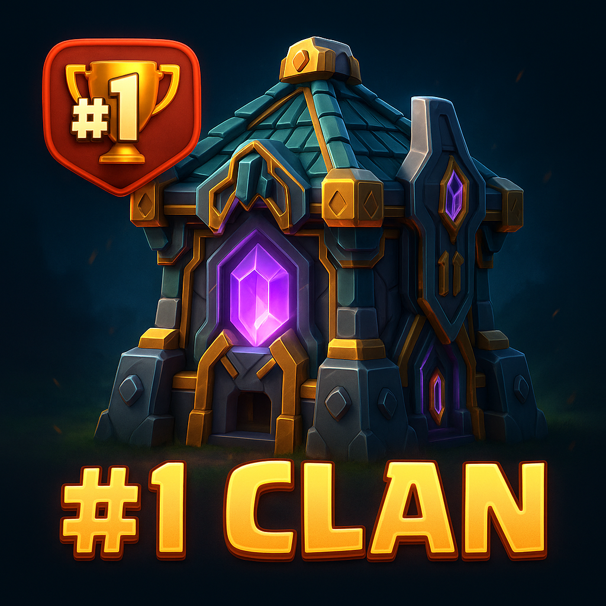

# 🏆 Clash Commander Bot

<p align="center">
  
</p>

A modular, API-powered Discord bot for elite **Clash of Clans** clans.

> Automate Town Hall roles, link players, organize base layouts, and prep for war — all in one sleek and expandable system.

---

## ✨ Features

- 🔗 `/link @user #tag` – Link Discord users to Clash accounts via the official API
- 🏰 Auto-assign Town Hall roles (TH13–TH17 ready)
- 🧱 `/addbase` – Save and categorize base links by TH and layout (ring, box, diamond, etc.)
- 📂 JSON-backed user + base storage
- ⚔️ Future support: `/currentwar`, `/raid`, attack logs, and reminders

---

## ⚙️ Setup

```bash
git clone https://github.com/YOURNAME/clash-commander-bot
cd clash-commander-bot
npm install
```

Create a `.env` file in the root folder:

```env
DISCORD_TOKEN=your_discord_bot_token
CLASH_API_TOKEN=your_clash_api_token
```

---

## 🚀 Run the Bot

```bash
npm start
```

Your bot should log in and register slash commands on startup.

---

## 📡 Slash Commands Available

| Command        | Description                                  |
|----------------|----------------------------------------------|
| `/link`        | Link a Clash player tag to a Discord user    |
| `/stats`       | View player stats (TH, trophies, war stars)  |
| `/clanmembers` | List all clan members and their tags         |
| `/addbase`     | Save a base link by TH + type (coming soon)  |

---

## 🧱 Folder Structure

```
ClashCommanderBot/
├── commands/           # Slash commands
├── utils/              # API + storage logic
├── data/               # JSON for linked users, bases
├── assets/             # Image/logo assets
├── index.js            # Bot entry
├── keepAlive.js        # Render keep-alive
├── .env                # Secrets (never commit this)
├── .gitignore
```

---

## 📌 Requirements

- Node.js v18+
- Discord bot token (from [Discord Dev Portal](https://discord.com/developers/applications))
- Clash API token (from [developer.clashofclans.com](https://developer.clashofclans.com))

---

## 🔮 Future Plans

- `/currentwar` tracking and attack summary
- `/raidassign` for Raid Weekend task planning
- Base image previews with Puppeteer
- Stats dashboard with TH role sync

---

## 🛡️ Built For

Serious clans that want a clean, automated Discord — no bloat, just power tools.

> ⚙️ Built with `discord.js` • Powered by the Clash of Clans public API

---
